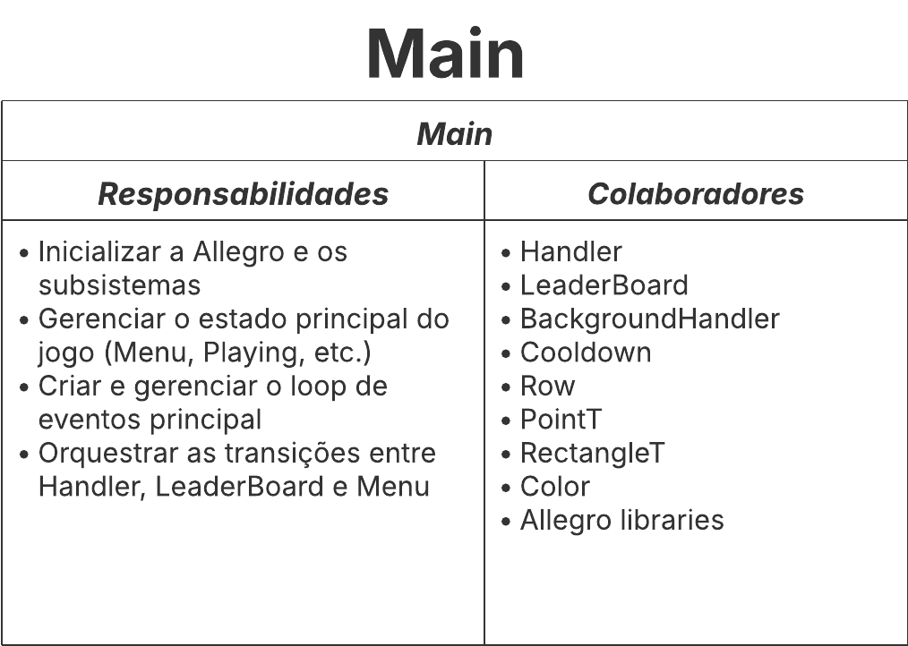

# Projeto Final de PDS2: Peitche!

Este projeto foi desenvolvido como trabalho final para a disciplina de Programação e Desenvolvimento de Software 2 (PDS2) na Universidade Federal de Minas Gerais (UFMG).

- **Disciplina:** Programação e Desenvolvimento de Software 2
- **Professores:** Luiz Chaimowicz & Héctor Azpúrua
- **Equipe:**
  - Renato Vilela
  - Cauã Neto
  - Rafael Baracat
  - Pedro Augusto
  - Mateus Cabral

---

## 1\. Resumo do Projeto

O projeto consiste em um jogo 2D do gênero _endless runner_ (corrida infinita), inspirado em clássicos como Flappy Bird. O jogador controla um personagem que deve desviar de uma série de obstáculos que surgem dinamicamente. O objetivo é percorrer a maior distância possível, e a pontuação é registrada para competir em um placar de líderes (leaderboard).

As principais funcionalidades incluem:

- **Jogabilidade principal:** Controle do jogador, geração procedural de obstáculos e sistema de pontuação baseado no tempo de sobrevivência.
- **Múltiplos tipos de obstáculos:** O jogo inclui obstáculos estáticos (canos) e dinâmicos (enguias que giram).
- **Sistema de Cadastro e Perfis:** Os jogadores podem criar perfis com nome e apelido, que são usados para salvar as pontuações.
- **Leaderboard Persistente:** As pontuações são salvas em um arquivo `.csv`, permitindo que os melhores resultados sejam mantidos entre as sessões de jogo.
- **Interface Gráfica e Animação:** O jogo utiliza a biblioteca Allegro 5 para renderização, com menus interativos, animações de sprites e um plano de fundo com efeito de paralaxe para criar profundidade visual.
- **Detecção de Colisão:** Utiliza o Teorema do Eixo de Separação (SAT) para uma detecção de colisão precisa entre o jogador e os obstáculos.

---

## 2\. Arquitetura do Projeto (Módulos e CRC)

A arquitetura do projeto foi modelada utilizando cartões CRC (Classe-Responsabilidade-Colaborador) para definir a função de cada componente principal e suas interações.

### Módulo Principal (`Main`)

Responsável por inicializar a biblioteca Allegro, gerenciar a máquina de estados do jogo (Menu, Jogando, Game Over, etc.), criar o loop de eventos principal e orquestrar a transição entre as diferentes telas e módulos do jogo.



### Módulo de Jogabilidade (`Handler`)

Gerencia o loop da partida em si. É responsável por criar e gerenciar o jogador, gerar, destruir e atualizar os obstáculos, verificar colisões, lidar com a lógica de morte e desenhar todos os objetos na tela.


### Módulo de Entidades e Objetos do Jogo

Este módulo contém a hierarquia de classes que representam todos os elementos visuais e interativos do jogo.


### Módulo de Detecção de Colisão

Implementa a lógica matemática e geométrica para detectar colisões entre entidades.


### Módulo de Animação e Gráficos

Gerencia os recursos visuais, como folhas de sprites para animações e o plano de fundo com rolagem.


### Módulo de Persistência de Dados e Leaderboard

Responsável por gerenciar os dados dos jogadores, como perfis e pontuações, e por salvá-los e carregá-los de um arquivo.


### Módulos Utilitários

Classes de apoio que fornecem funcionalidades genéricas usadas em todo o projeto.


---

## 3\. Ferramentas Utilizadas

- C++
  - Biblioteca Allegro5
- Cartões CRC
- Doctest
- Doxygen
- Git e GitHub
- Makefile

---

## 4\. Estrutura de Arquivos

- **assets**: recursos utilizados pelo programa como imagens, sprites, fontes etc.
- **bin**: executáveis gerados pela compilação, criados durante a compilação pelo Makefile.
- **include**: arquivos de cabeçalho (`.hpp`) do projeto.
- **obj**: arquivos objeto (`.o`) criados durante a compilação.
- **src**: arquivos de código-fonte (`.cpp`).
- **tests**: arquivos de teste para validação do código.
- **.gitignore**: arquivos e pastas que o Git deve ignorar.
- **Makefile**: instruções para automatizar a compilação do projeto.

---

## 5\. Como Compilar e Executar

Para compilar e executar o projeto, siga os passos abaixo.

### Pré-requisitos

- **GCC (G++)** com suporte a C++11 ou superior.
- **Make**.
- **Allegro 5**: É necessário ter a biblioteca Allegro 5 e seus add-ons instalados:
  - `allegro`
  - `allegro_primitives`
  - `allegro_image`
  - `allegro_font`
  - `allegro_ttf`
  - `allegro_audio`
  - `allegro_acodec`

### Passos

1.  **Clone o repositório:**

    ```bash
    git clone <URL_DO_REPOSITORIO>
    cd <NOME_DA_PASTA_DO_PROJETO>
    ```

2.  **Compile o projeto:**
    Execute o comando `make` no diretório raiz do projeto. O Makefile irá compilar todos os arquivos-fonte e criar o executável no diretório `bin/`.

    ```bash
    make
    ```

3.  **Execute o jogo:**
    Após a compilação, execute o arquivo gerado.

    ```bash
    ./bin/main
    ```
